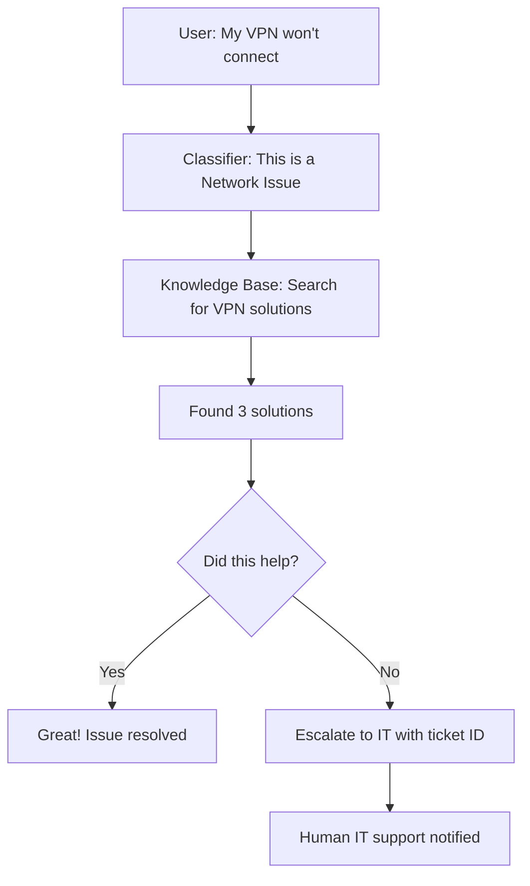

# Overview

## What is HelixDesk AI?

**HelixDesk AI** (also known as **SupportX AI Assist**) is an intelligent IT support automation system that uses artificial intelligence and multiple AI agents working together to automatically resolve IT tickets.

## The Problem We Solve

### Traditional IT Support Challenges

-   :material-trending-up: **Scalability Problem**

    ---

    As companies grow, IT ticket volume grows exponentially, overwhelming support teams.

-   :material-puzzle: **Knowledge Fragmentation**

    ---

    Solutions are scattered across wikis, documents, and tribal knowledge—hard to find and inconsistent.

-   :material-repeat: **Repetitive Work**

    ---

    IT professionals waste 60-70% of time answering the same questions repeatedly.

-   :material-clock-alert: **Slow Response Times**

    ---

    Average ticket resolution: 2-5 days. Ticket queues create bottlenecks.

-   :material-moon-waning-crescent: **After-Hours Issues**

    ---

    No support outside business hours when problems don't sleep.

-   :material-account-multiple-check: **Inconsistent Solutions**

    ---

    Different IT staff provide different answers to the same problem.

### How HelixDesk AI Addresses Each Challenge

| Challenge | HelixDesk AI Solution |
|-----------|----------------------|
| **Scalability** | Handles unlimited concurrent tickets—10 or 10,000 users simultaneously |
| **Knowledge Fragmentation** | Vector search finds the right solution from thousands in milliseconds |
| **Repetitive Work** | AI handles routine issues; humans focus on complex problems |
| **Slow Response** | Average response time: **7 seconds** (vs. 48 hours traditional) |
| **24/7 Availability** | Works nights, weekends, holidays—always on |
| **Consistency** | Same high-quality answer every time, based on verified knowledge base |

---

## How It Works

Think of HelixDesk AI as a **team of three specialized AI assistants** working together:

### :material-sort: Agent 1: The Classifier (The Organizer)

**Job**: Figures out what type of problem you have

**Example**: "Oh, this is a password reset issue, not a network problem"

**Why it matters**: Helps find the right solution faster by narrowing down the search

### :material-database-search: Agent 2: The Knowledge Base Expert (The Researcher)

**Job**: Searches through all IT solutions to find the best match

**How**: Uses "vector search"—understands *meaning*, not just keywords

**Example**: If you say "My email won't open" and "Outlook crashes immediately", it knows these are the same problem

**Result**: Gives you the top 3 most relevant solutions

### :material-email-alert: Agent 3: The Escalation Manager (The Helper)

**Job**: If AI can't solve your problem, it immediately alerts human IT support

**How**: Sends a detailed email with your issue and a ticket ID

**Result**: You get human help without having to do anything extra

---

## The Process

---

## Key Statistics

!!! info "Industry Averages"
    - **Global IT support market**: $350 billion/year
    - **Average ticket volume**: 1 ticket per employee per month
    - **Resolution time**: 2-5 days (traditional)
    - **First-contact resolution**: Only 30-40%
    - **IT labor cost**: $50-80 per hour
    - **Employee productivity loss**: 4-8 hours per unresolved ticket

!!! success "HelixDesk AI Performance"
    - **Response time**: 5-10 seconds
    - **Resolution rate**: 70-85% automated
    - **Cost per ticket**: ~$5 (vs. $35 traditional)
    - **Availability**: 24/7/365
    - **Scalability**: Unlimited concurrent users

---

## Real-World Impact

### For Employees (End Users)

- ✅ **Instant help**: 5-second responses vs. 2-day wait times
- ✅ **24/7 availability**: No more waiting for business hours
- ✅ **Self-service**: Empowering, no dependency on IT
- ✅ **Reduced frustration**: Clear, step-by-step solutions
- ✅ **Productivity**: Back to work in minutes, not days

### For IT Teams

- ✅ **70% ticket reduction**: AI handles routine issues
- ✅ **Focus on strategic work**: Infrastructure, security, projects
- ✅ **Lower burnout**: Fewer repetitive questions
- ✅ **Better visibility**: Automated logging and analytics
- ✅ **Scalability**: Handles growth without hiring

### For Companies

- ✅ **Cost savings**: $15-30 per ticket automated
- ✅ **Employee satisfaction**: Higher NPS scores
- ✅ **Compliance**: Consistent, documented solutions
- ✅ **Knowledge retention**: Solutions don't leave with employees
- ✅ **Data insights**: Identify systemic issues

---

## Use Cases Beyond IT Support

This architecture can be adapted for:

1. **Customer Support**: E-commerce returns, product questions
2. **HR Helpdesk**: Benefits, leave policies, onboarding
3. **Legal Q&A**: Contract templates, policy questions
4. **Medical Triage**: Symptom assessment (with disclaimers)
5. **Educational Tutoring**: Student questions, concept explanations
6. **Financial Advice**: Account questions, transaction issues

---

## Next Steps

Ready to dive deeper?

- **[Why HelixDesk AI?](why-helixdesk.md)** - Detailed comparison and benefits
- **[Quick Start](quick-start.md)** - Get up and running in 10 minutes
- **[Architecture Overview](../architecture/overview.md)** - Technical deep dive
